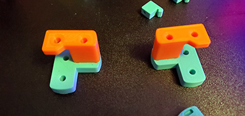
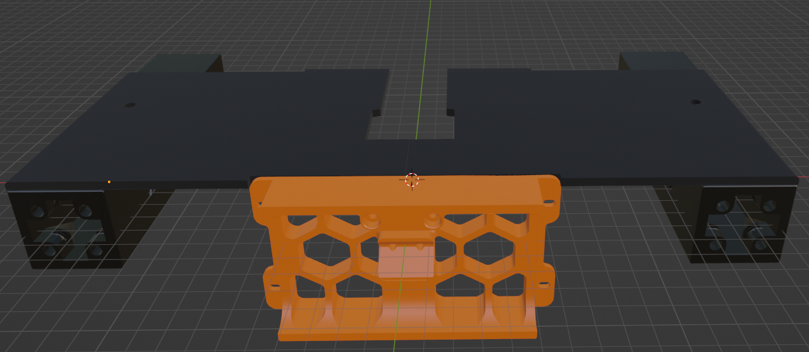
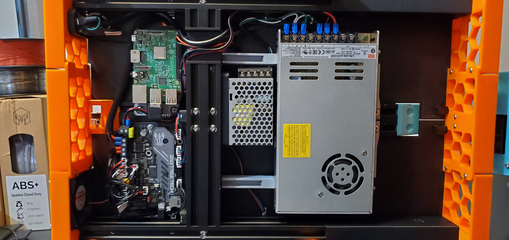

I recently finished streaming my build series for a very popular Ender 3 to Voron Switchwire conversion. The repository for that conversion can be found here: https://github.com/boubounokefalos/Ender_SW. During the build I ran into a few things that I wanted to change to make my Ender Switchwire more like my actual Switchwire. Note that I do not plan on enclosing this printer.

To do this I made a few changes and have shared the STL files for those customizations here.

The first simple modifications I made were to the upper idlers. I also had to make some thinner XY Tensioners as I found the originals were too wide and would not fit.

The rest of the modifications were pretty sustatial.  First, I wanted to extend the deck to be close to the same length as the real Switchwire and allow me to attach a display in the same way. I go through the install in this live stream: https://www.youtube.com/watch?v=oB8BYyM82n4&t=2573s.

To accomplish this I replaced the existing extensions with a set of longer extensions. This modification does away with the requirement for 8 M5x60 SHCS bolts. Instead you will need 
  - 16 M5x20 SHCS or BHCS bolts
  - 8 M5x20 SHCS bolts
  - 2 M5x16mm bolts
  - 18 M5 nuts

There are two sets of deck plates.  One set is a full replacement for the front decks, the other is just a set of extensions (pictured).

(full front decks)

Finally, I updated the layout of the electronics bay to make eveything a little more accessable. This required a new mount for the Raspberry Pi and longer 4040 power supply mounts. I also moved the plug form the middle to the side.

