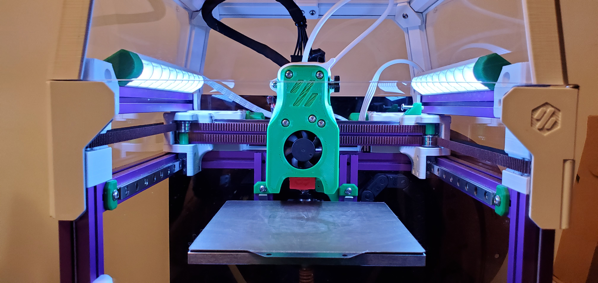

I didn't find any NEOPixel strips for My V0 that I  liked so I made some.

The installation is pretty simple.  You need to solder a wire to output the signal to the input of second stip or other stips you may have installed. Solder 4 wire connectores to each strip and connect as required.  In my case I have the V0.1 Umbilical si I just hooked them up to it. 

Basically, just hook them up as you would any NeoPixel strip. 

The final result should look something like this.

